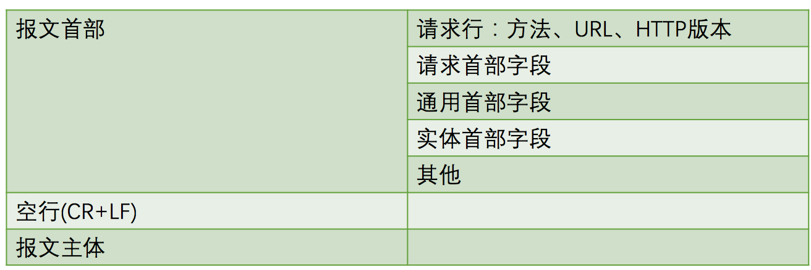
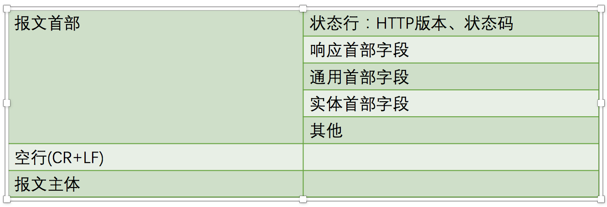
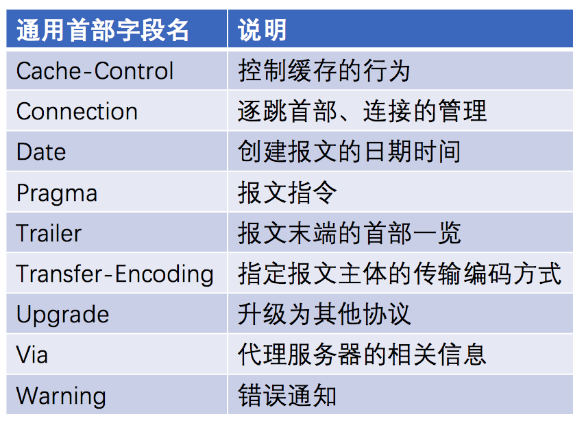
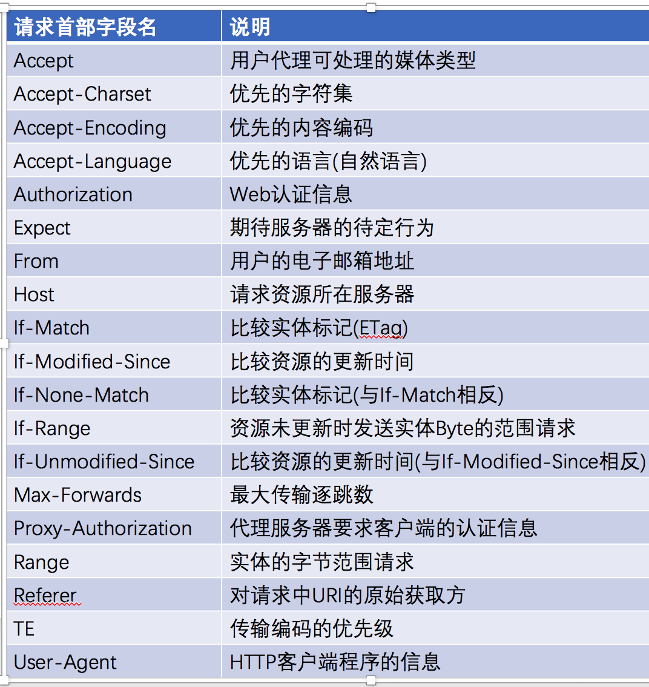
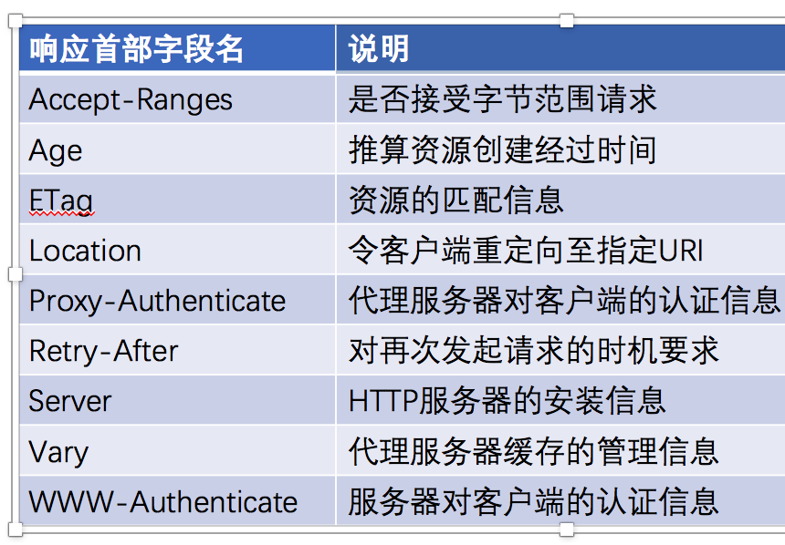
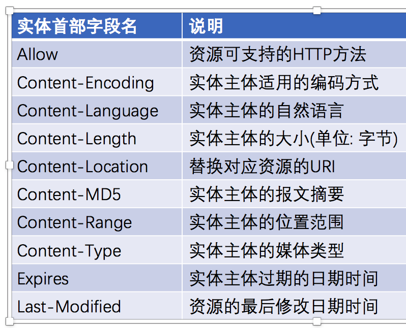
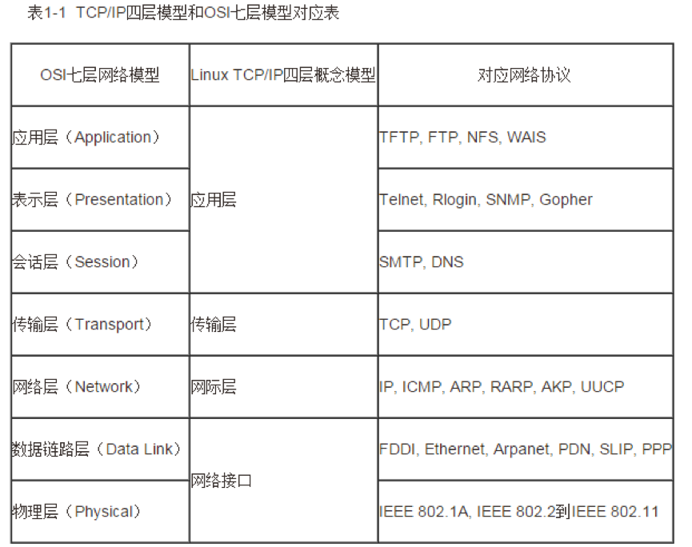
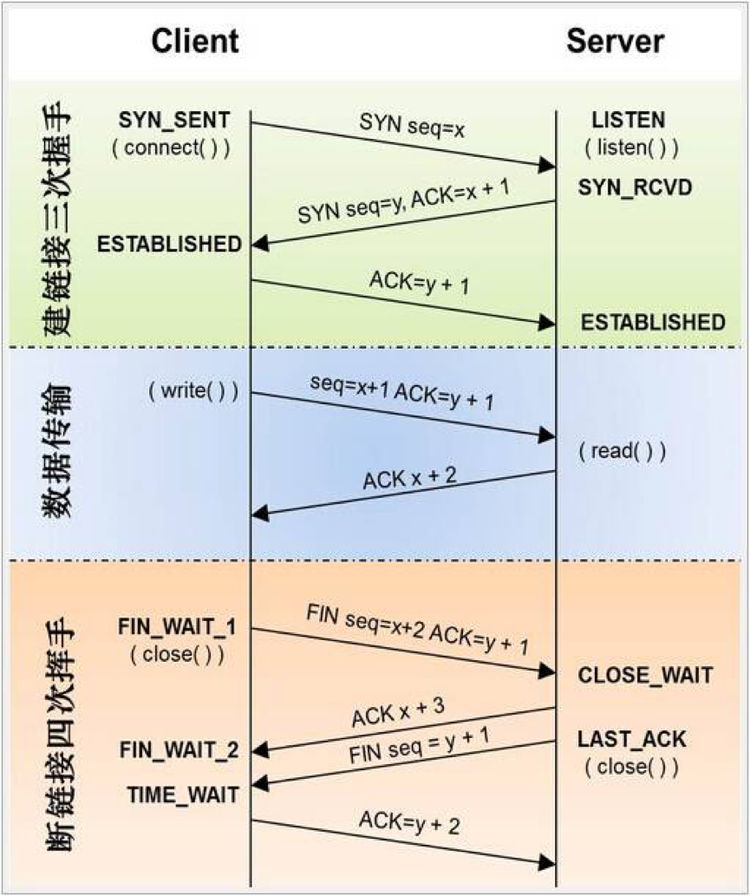
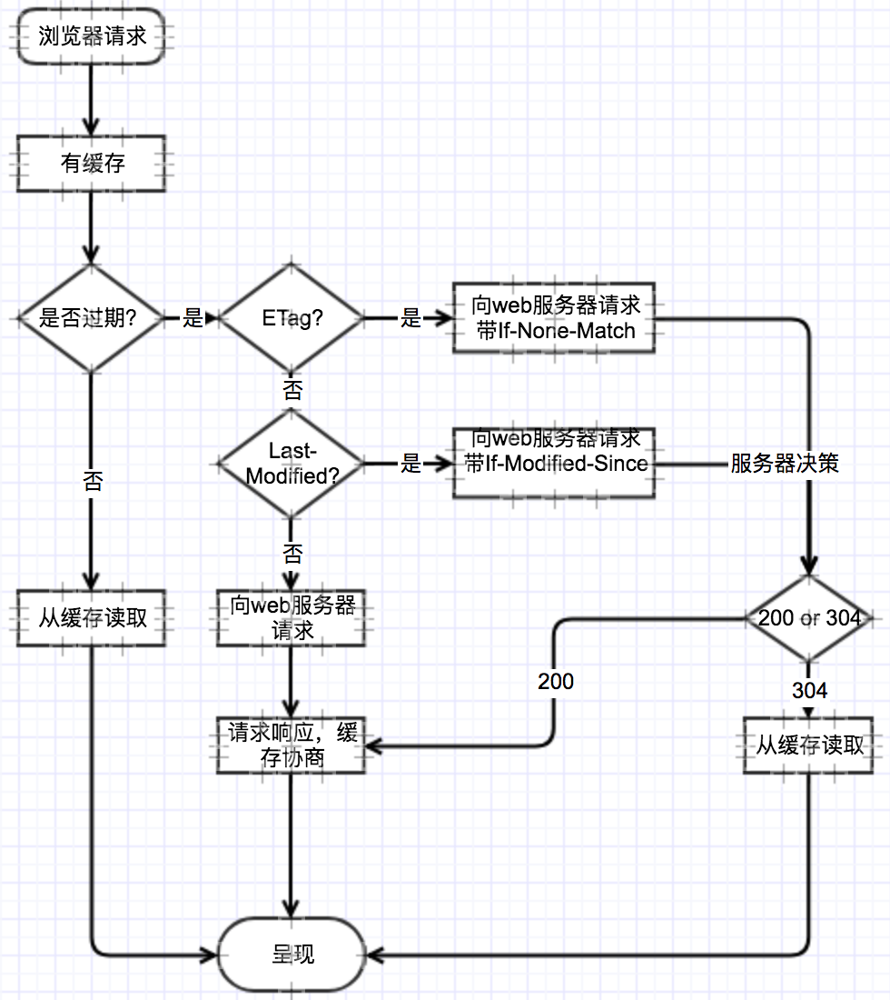

### http协议

* 请求报文



* 响应报文



* HTTP1.1首部字段一览

通用首部字段



请求首部字段



响应首部字段



实体首部字段



### HTTP1.X和HTTP2.0的区别

* 多路复用

做到同一个连接并发处理多个请求，并且并发请求的数量比HTTP1.1大了好几个数量级。

* header的数据压缩

* 服务器推送

### TCP/IP

* IP(Internet Protocol)：根据网络情况，将要传输的数据，分为不同大小的包、固定的格式，在源地址和目的地址之间传递。

* TCP(Transmission Control Protocol)：一种面向连接的、可靠的、基于字节流的传输层的传输通信协议。

* TCP首部6个标志比特位

URG：紧急指针

ACK：确认序号有效

PSH：尽可能快地将数据送往接收进程

RST：重建连接

SYN：同步序号用来发起一个连接

FIN：发端完成发送任务

* TCP和UDP的区别

TCP是有连接的，两台主机在进行数据交互之前必须通过三次握手建立连接；而UDP是无连接的，没有建立连接整个过程。

TCP是可靠的传输，TCP协议通过确认和重传机制来确保数据传输的可靠性；而UDP是不可靠传输。

TCP提供了拥塞控制、滑动窗口等机制来保证传输的质量，而UDP是不可靠的传输。

TCP是基于字节流的，将数据看做无结构的字节流进行传输，当应用程序交给TCP的数据长度太长，超过MSS时，TCP就会对数据进行分段，因此TCP的数据是无边界的；UDP是面向报文的，无论应用程序交给UDP层多长的报文，UDP都不会对数据报进行任何拆分等处理，因此UDP保留了应用层数据的边界。

* 其他

1. TCP协议有拥塞控制和流量控制的功能

拥塞控制就是防止更多的数据注入网络中，这样可以使网络中的路由器或链路不致过载。

流量控制解决的问题是如果发送方把数据放松得过快，接受方可能会来不及接收，这就会造成数据的丢失。

2. TFTP底层使用的协议是UDP，是TCP/IP协议族中的一个用来在客户机与服务器之间进行简单文件传输的协议，提供不复杂、开销不大的文件传输服务。

3. 在TCP/UDP传输段中，源端口地址和目的端口地址是不能相同的。

### TCP/IP四层模型和OSI七层模型



### 三次握手四次挥手



### 状态码

200 OK   204 No Content

301 Moved Permanently   302 Move temporarily   304 Not Modified

400 Bad Request   401 Unauthorized   403 Forbidden   404 Not Found   405 Method Not Allowed

500 Internal Server Error   502 Bad Gateway   503 Service Unavailable   504 Gateway Timeout   505 HTTP Version Not Supported

1XX: 指示信息，表示请求已接收，继续处理

2XX: 成功，表示请求已被成功接收、理解

3XX: 重定向，要完成请求必须进行更近一步的操作

4XX: 客户端错误，请求要语法错误或请求无法实现

5XX: 服务器端错误，服务器未能实现合法的请求

### 方法

HTTP1.0: GET、POST、HEAD

HTTP1.1: OPTIONS、PUT、DELETE、TRACE、CONNECT

### 浏览器输入URL到页面显示整个过程发生了什么

*加载过程*

* 浏览器根据DNS服务器解析得到域名的IP地址

* 向这个IP的机器发送HTTP请求

* 服务器收到、处理并返回HTTP请求

* 浏览器得到返回内容

*渲染过程*

* 根据HTML结构生成DOM树

* 根据CSS生成CSSOM

* 将DOM和CSSOM整合成Render Tree

* 根据Render Tree开始渲染和展示

* 遇到script时，会执行并阻塞渲染

### 缓存

#### 强缓存

* expires(HTTP1.0)

绝对时间的GMT格式的时间字符串

如果发送请求的时间在expires之前，那么本地缓存始终有效，否则就会发送请求到服务器来获取资源。

* cache-control(HTTP1.1)

max-age=number

no-cache: 不使用本地缓存，需要使用协商缓存。

no-store: 直接禁止浏览器缓存数据，每次用户请求该资源，都会向服务器发送一个请求，每次都会下载完整的资源。

public: 可以被所有用户缓存

private: 只能被终端用户的浏览器缓存

* 如果cache-control和expires同时存在的话，cache-control的优先级高于expires

#### 协商缓存

是由服务器来确定缓存资源是否可用的。

成对出现，即第一次请求的响应头带上某个字段(Last-Modified或者ETag)，则后续请求则会带上对应的请求字段(If-Modified-Since或者If-None-Match)，若响应头没有Last-Modified或者ETag字段，则请求头也不会有对应的字段。

Last-Modified/If-Modified-Since

ETag/If-None-Match

Last-Modified与ETag优先验证Tag



### Web端即时通讯

#### 传统Ajax短轮询

#### Comet技术

##### 长轮询

长轮询是在打开一条连接以后保持，等待服务器推送来数据再关闭的方式。

##### iframe流

iframe流方式是在页面中插入一个隐藏的iframe，利用其src属性在服务器和客户端之间创建一条长链接，服务器向iframe传输数据，来实时更新页面。

#### WebSocket

WebSocket协议本质上是一个基于TCP的协议，在单个TCP连接上进行全双工通讯。

为了建立一个WebSocket连接，客户端浏览器首先要向服务器发起HTTP请求，这个请求和通常的HTTP请求不同，包含了一些附加头信息，其中附加头信息"Upgrade: WebSocket"表明这是一个申请协议升级的HTTP请求，服务器端解析这些附加的头信息然后产生应答信息返回给客户端，客户端和服务器段的WebSocket连接就建立起来了，双方就可以通过这个连接通道自由地传递信息，并且这个连接会持续存在直到客户端或者服务器端的某一方主动地关闭连接。

* WebSocket属性

只读属性readyState表示连接状态

0: 表示连接尚未建立。

1: 表示连接已建立，可以进行通信。

2: 表示连接正在进行关闭。

3: 表示连接已经关闭或者连接不能打开。

只读属性bufferedAmount已被send()放入正在队列中等待传输，但是还没有发出的UTF-8文本字节数。

````
function testWebSocket() {
    if ('WebSocket' in window) {
        //创建WebSocket对象
        var ws = new WebSocket(url, [protocol]);
        
        //连接建立时触发
        ws.open = function() {
            //使用连接发送数据
            ws.send();
        }

        //客户端接收服务端数据时触发
        ws.onmessage = function(evt) {
            console.log('接收的数据', evt.data);
        }

        //通信发生错误时触发
        ws.error = function() {
            //关闭连接
            ws.close();
        }

        //连接关闭时触发
        ws.close = function() {

        }
    } else {
        console.log('Brower cann't support WebSockt.');
    }
}
````

#### SSE(Server-sent Events)

