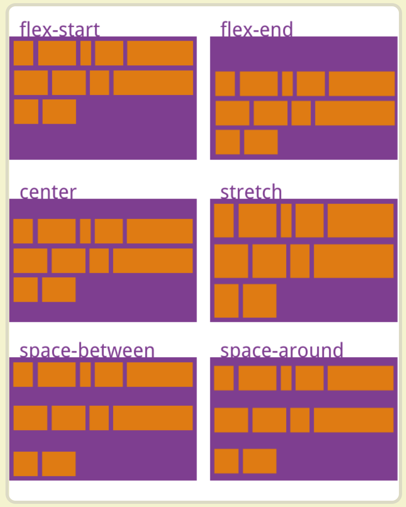

### CSS选择器

#### CSS选择器


#### CSS选择器优先级

* 内联样式，如style="XXX"，权值为1000

* ID选择器，如#content，权值为100

* 类、伪类和属性选择器，如.content、:hover、[attribute]，权值为10

* 元素和伪元素选择器，如div、p，权值为1

* 通用选择器(*)、子选择器(>)和相邻同胞选择器(+)权值为0

### 伪类 伪元素

#### 伪类和伪元素的区别

* 是否抽象创建了新元素

* 伪类本质上是为了弥补常规CSS选择器的不足，以便获取到更多信息；伪元素本质上是创建了一个有内容的虚拟容器

* CSS3中伪类和伪元素的语法不同，规定伪类用一个冒号来表示，伪元素用两个冒号来表示

* 伪类只要不是互斥就可以叠加使用，而只能同时使用一个伪元素

* 伪类优先级比伪元素优先级高

CSS伪类用于向某些选择器添加特殊的效果。


CSS伪元素用于将特殊的效果添加到某些选择器。


### CSS的就近原则 | 爱恨原则

爱恨原则(LoVe HAte): link visited hover active

当鼠标经过未访问的链接，会同时拥有a:link、a:hover两种属性，a:link离它最近，所以它优先满足a:link，而放弃a:hover的重复定义。

当鼠标经过已经访问过的链接，会同时拥有a:visited、a:hover两种属性，a:visited离它最近，所以它优先满足a:visited，而放弃a:hover的重复定义。

### CSS模型


````
//标准模型
box-sizing: content-box;
//IE模型
box-sizing: border-box;
````

### BFC(Block Formatting Context) 块级格式化上下文

独立的渲染区域，只有Block-level box参与，它规定了内部的Block-level Box如何布局，并且与这个区域外部毫不相关。

#### BFC布局规则

* 内部的box会在垂直方向，一个接一个地放置

* box垂直方向的距离由margin决定，属于同一个BFC的两个相邻box的margin会发生重叠

* 每个元素的margin box的左边，与包含块border box的左边相接触(对于从左往右的格式化，否则相反)，即使存在浮动也是如此。

* BFC的区域不会与float box重叠

* BFC是页面上的一个隔离的独立容器，容器里面的子元素不会影响到外部的元素，反之也如此

* 计算BFC高度的时候，浮动元素也会参与计算

#### 创建BFC

* 根元素

* float属性不为none(脱离文档流)

* position为absolute或fixed

* display为inline-block, table-cell, table-caption, inline-flex

* overflow不为visible

#### 应用场景

* 自适应两栏布局

* 消除内部浮动

* 防止垂直margin重叠

### position

#### static | inherit

#### relative

relative会导致自身位置的相对变化，而不会影响其他元素的位置、大小。

#### absolute

absolute元素脱离了文档结构: 和relative不同，其他三个元素的位置重新排列了。只要元素会脱离文档结构，它就会产生破坏性，导致父元素坍塌。

包裹性: 之前p的宽度是撑满整个屏幕的，而此时p的宽度刚好时内容的宽度。

跟随性: 虽然absolute元素脱离了文档结构，但是它的位置并没有发生变化，还是老老实实地呆在它原本的位置，因为我们此时没有设置top、left的值。

absolute元素会悬浮在页面上方，会遮挡住下方的页面内容。

#### sticky

在屏幕范围(viewport)时该元素的位置并不受到定位影响(设置是top、left属性无效)，当该元素的位置将要移除偏移范围时，定位又会变成fixed，根据设置的left、top等属性成固定位置的效果。

##### sticky出现的原因

监听scroll事件来实现粘性布局使浏览器进入慢滚动的模式，这与浏览器想要通过硬件加速来提升滚动的体验是相驳的。

##### position:sticky的表现上像是position: fixed和position: relative的结合体，特征如下：

* 元素不会脱离文档流，并保留元素在文档流中占位的大小

* 元素在容器中被滚动超过指定的偏移值时，元素在容器内固定在指定位置

* 元素固定的相对偏移时相对于离它最近的具有滚动框的祖先元素(BFC|最近的块级祖先元素)，如果祖先元素都不可以滚动，那么是相对于viewport来计算元素的偏移量。

##### 生效条件

* 必须指定top, right, bottom或left四个闸值之一，才可使粘性定位生效。否则其行为与相对定位相同。

top和bottom同时设置时，top生效的优先级高；left和right同时设置时，left的优先级高。

* 设定为position: sticky元素的任意父节点的overflow属性必须是visible，否则position: sticky不会生效。

如果position: sticky元素的任意父节点定位设置为overflow: hidden，则父容器无法进行滚动，所以position: sticky元素也不会有滚动然后固定的情况。

如果position: sticky元素的任意父节点定位设置为position: relative | absolute | fixed，则元素相对父元素进行定位，而不会相对viewport定位。

* 达到设定的闸值。设定position: sticky的元素表现为relative | fixed时根据元素是否达到设定的闸值决定的。

##### 定位上下文

* relative元素的定位永远是相对于元素自身设置的，和其他元素没关系，也不会影响其他元素。

* fixed元素的定位是相对于window(或iframe)边界的，和其他元素没有关系，脱离文档流。但是它具有破坏性，会导致其他元素位置的变化。

* absoulte会递归查找该元素的所有父元素，如果找到一个设置了position:relative/absolute/fixed的元素，就以该元素为基准定位，如果没找到，就以浏览器边界定位。

Code Ex:

````
<body style="margin: 0;padding: 0;">
    <div id="box" style="top:10px;margin: 20px 10px;"></div>
</body>
````

给#box设置position:static,则上边距为20px

给#box设置position:relative,则上边距为30px

给#box设置position:absolute,则上边距为30px

给#box设置position:sticky,则滚动起来上边距为10px，不滚动则为20px


### Flex(弹性)布局 一维

参考链接: http://www.ruanyifeng.com/blog/2015/07/flex-grammar.html


#### 容器的属性

* flex-direction设置主轴的方向

````
.box {
    flex-direction: row | row-reverse | column | column-reverse;
}
````

row(默认值): 主轴为水平方向，起点在左端。

row-reverse: 主轴为水平方向，起点在右边。

column: 主轴为垂直方向，起点在上沿。

column-reverse: 主轴为垂直方向，起点在下沿。

* flex-wrap属性定义如果一条轴线排不下，如何换行。

````
.box {
    flex-wrap: nowrap | wrap | wrap-reverse;
}
````

nowrap(默认): 不换行

wrap: 换行，第一行在上方

wrap-reverse: 换行，第一行在下方

* flex-flow属性是flex-direction属性和flex-wrap属性的简写形式。

* justify-content属性定义了项目在主轴上的对齐方式


flex-start(默认值): 左对齐

flex-end: 右对齐

center: 居中

space-between: 两端对齐，项目之间的间隔都相等

space-around: 每个项目两侧的间隔相等。所以，项目之间的间隔比项目与边框的间隔大一倍。

* align-items属性定义项目在交叉轴上如何对齐


flex-start: 交叉轴的起点对齐

flex-end: 交叉轴的终点对齐

center: 交叉轴的中点对齐

baseline: 项目的第一行文字的基线对齐

stretch(默认值)：如果项目未设置高度或设为auto，将占满整个容器的高度。

* align-content属性定义了多根轴线的对齐方式。



flex-start: 与交叉轴的起点对齐

flex-end: 与交叉轴的终点对齐

center: 与交叉轴的中点对齐

space-between: 与交叉轴两端对齐，轴线之间的间隔平均分布。

space-around: 每根轴线两侧的间隔都相等。所以，轴线之间的间隔比轴线与边框的间隔大一倍。

stretch(默认值): 轴线占满整个交叉轴

#### 项目的属性

* order属性定义项目的排列顺序

* flex-grow属性定义项目的放大比例

* flex-shrink属性定义了项目的缩小比例

* flex-basis属性定义了在分配多余空间之前，项目占据的主轴空间。

* flex属性是flex-grow, flex-shrink, flex-basis的简写。

flex: none <=> flex: 0 0 auto

flex: auto <=> flex: 1 1 auto

flex: 非负数字 <=> flex: number 1 0;(n is a length unit)

设置在子项，数值表示占据剩余空间的份数

flex: 长度或百分比 <=> flex: 1 1 长度或百分比

当flex取值为两个非负数字，则分别视为flex-grow和flex-shrink的值，flex-basis取0%

当flex取值为一个非负数字和一个长度或百分比，则分别视为flex-grow和flex-basis的值，flex-shrink取1。

* align-self属性允许单个项目有与其他项目不一样的对齐方式

align-self: auto | flex-start | flex-end | center | baseline | stretch

设为flex布局之后，子元素的float、clear和vertical-align属性将失效。

#### Flex浏览器兼容性

````
.flex-container {
    /* 老版本语法: Safari3.1-6, Android browser, older webkit browser */
    display: -webkit-box;
    /* 老版本语法: Firefox19- (buggy but mostly works) */
    display: -moz-box;
    /* 混合版本 IE10 */
    display: -ms-flexbox;
    /* 新版本语法: Chrome 21+ */
    display: -webkit-flex;
    /* 新版本语法 */
    display: flex;
}
````

### Grid(网格)布局 二维

Grid布局由两个核心组成部分wrapper(父元素)和items(子元素)。wrapper是实际的grid(网格)，items是grid(网格)内的内容。

定义列和行: grid-template-row grid-template-column

定位和调整items(子元素)大小: grid-column grid-row

````
.wrapper {
    display: grid;
    grid-template-columns: 100px 100px 100px;
    grid-template-rows: 50px 50px;
}
.item1 {
    grid-column: 1 / 4;
}
.item3 {
    grid-row-start: 2;
    grid-row-end: 4;
}
.item4 {
    grid-column-start: 2;
    grid-column-end: 4;
}
````

### display


### 内联元素 块级元素

* inline 内联元素

strong em label input select textarea img br a

* block 块级元素

blockquote标签定义摘自另一个源的块引用。

ol ul

dl标签定义了定义列表(definition list)。

dl标签用于结合dt(定义列表中的项目)和dd(描述列表中的项目)

````
<ol start="7">
    <li>Tea</li>
</ol>

<dl>
    <dt>计算器</dt>
    <dd>用来计算的仪器</dd>
</dl>
````

table form

fieldset标签可以将表单内的相关元素分组。

````
<form>
    <fieldset>
        <!-- 
<legend>标签为<fieldset>标签定义标题。 -->
        <legend>Personalia:</legend>
        Name: <input type="text"/>
    </fieldset>
</form>
````

pre元素可定义预格式化的文本。被包围在pre元素中的文本通常会保留空格和换行符。

#### 内联元素和块级元素的区别

块级元素总是在新行上开始；内联元素都在一行上

内联元素设置高度、上下margin/padding无效

块级元素宽度缺省是它的容器的100%，除非设定一个宽度。宽度就是它的文字或图片的宽度，不可改变

块级元素可以容纳内联元素和其他块级元素；内联元素只能容纳文本或者其他内联元素

### 渐进增强和优雅降级

渐进增强(Progressive Enhancement)：一开始就针对低版本浏览器进行构建页面，完成基本的功能，然后再针对高级浏览器进行效果、交互、追加功能达到更好的体验。

优雅降级(Graceful Degradation)：一开始就构建站点的完整功能，然后针对浏览器测试和修复。

### 浏览器兼容方式

CSS Hack

    属性级Hack

    选择符级Hack

    IE条件注释Hack

JS能力检测

### 响应式布局

* 声明viewport原标签

* 使用流式布局

* 所有容器都使用相对尺寸，不使用绝对尺寸

* CSS媒介查询

### link和import的区别

* 从属关系

link是XHTML提供的标签，不仅可以加载CSS文件，还可以定义RSS等事物。

import是CSS提供的语法规则，只能导入样式表。

* 加载顺序

link在页面加载时同时加载。

import时在页面加载完成之后再加载。

* 兼容性问题

link不存在兼容性问题

@import是CSS2.1才有的语法，只可在IE5+才能识别。

* DOM可控性

link支持使用JavaScript控制DOM去改变样式，@import不支持。

* 权重

link引入的样式权重大于@import引入的样式

### 获取宽高

* getComputedStyle

getComputedStyle会获取当前元素所有最终使用的CSS属性值

window.getComputedStyle <=> document.defaultView.getComputedStyle

计算得出 会引起回流

### 栅格布局

通过定义容器大小，平分成12份，在调整内外边距，最后结合媒体查询，就制作出强大的响应式栅格系统。