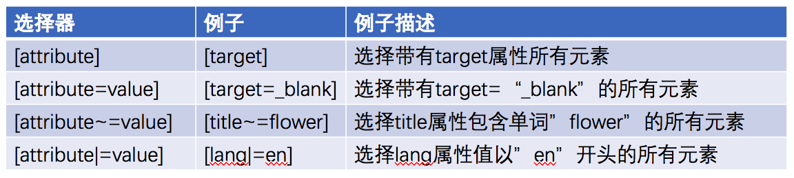
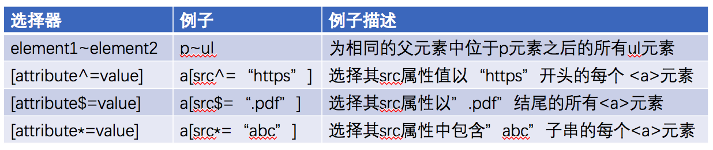
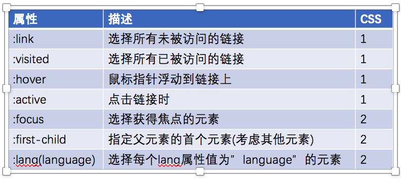

### CSS选择器
* CSS选择器


link visited hover active




* CSS选择器优先级

1.内联样式，如style="XXX"，权值为1000

2.ID选择器，如#content，权值为100

3.类、伪类和属性选择器，如.content、:hover、[attribute]，权值为10

4.元素和伪元素选择器，如div、p，权值为1

5.通用选择器(*)、子选择器(>)和相邻同胞选择器(+)权值为0

### CSS模型

````
//标准模型
box-sizing: content-box;
//IE模型
box-sizing: border-box;
````

### BFC(Block Formatting Context) 块级格式化上下文

独立的渲染区域，只有Block-level box参与，它规定了内部的Block-level Box如何布局，并且与这个区域外部毫不相关。

#### BFC布局规则

* 内部的box会在垂直方向，一个接一个地放置

* box垂直方向的距离由margin决定，属于同一个BFC的两个相邻box的margin会发生重叠

* 每个元素的margin box的左边，与包含块border box的左边相接触(对于从左往右的格式化，否则相反)。即使存在浮动也是如此。

* BFC的区域不会与float box重叠

* BFC是页面上的一个隔离的独立容器，容器里面的子元素不会影响到外部的元素。反之也如此。

* 计算BFC高度的时候，浮动元素也会参与计算

#### 创建BFC
* 根元素

* float属性不为none(脱离文档流)

* position为absolute或fixed

* display为inline-block, table-cell, table-caption, inline-flex

* overflow不为visible

#### 应用场景
* 自适应两栏布局

* 消除内部浮动

* 防止垂直margin重叠

### float
破坏性 包裹性 清空格
````
//伪元素:after
.clearfix:after {
    content: '';
    display: table;
    clear: both;
}
.clearfix {
    *zoom: 1; /* 兼容IE低版本 */
}
````
### position
* relative

relative会导致自身位置的相对变化，而不会影响其他元素的位置、大小。

* absolute

1.**absolute元素脱离了文档结构**：和relative不同，其他三个元素的位置重新排列了。只要元素会脱离文档结构，它就会产生破坏性，导致父元素坍塌。

2.**包裹性**：之前<p>的宽度是撑满整个屏幕的，而此时<p>的宽度刚好时内容的宽度。

3.**跟随性**：虽然absolute元素脱离了文档结构，但是它的位置并没有发生变化，还是老老实实地呆在它原本的位置，因为我们此时没有设置top、left的值。

4.absolute元素会悬浮在页面上方，会遮挡住下方的页面内容。

* 定位上下文

1.relative元素的定位永远时相对于**元素自身**设置的，~~和其他元素没关系，也不会影响其他元素~~。

2.fixed元素的定位是相对于**window(或iframe)边界**的，和其他元素没有关系。但是它具有**破坏性**，~~会导致其他元素位置的变化~~。

3.absoulte会递归查找该元素的所有**父元素**，如果找到一个设置了**position:relative/absolute/fixed**的元素，就以该元素为基准定位，如果没找到，就以**浏览器边界**定位。

### flex

* flex-direction设置主轴的方向
row(默认值)：主轴为水平方向，起点在左端。

row-reverse：主轴为水平方向，起点在右边。

column：主轴为垂直方向，起点在上沿。

column-reverse：主轴为垂直方向，起点在下沿。

* justify-content属性定义了项目在主轴上的对齐方式


* align-items属性定义项目在交叉轴上如何对齐

stretch(默认值)：如果项目未设置高度或设为auto，将占满整个容器的高度。


### 内联元素 块级元素
* 内联元素 display: inline;

a br img input span textarea

* 块级元素 display: block;

div dl(定义列表) form h1 hr ol(排序表单) p table

````
<dl>
    <dt>计算器</dt>
    <dd>用来计算的仪器</dd>
</dl>

<ol start="7">
    <li>Tea</li>
</ol>
````
### 居中
* 水平居中
````
//行内元素
.inline-element {
    text-align: center;
}
//块级元素
.block-element {
    text-align: center;
}
.item-block-element {
    width: 1000px;
    margin: auto;
}
//绝对定位元素结合left和margin实现，但是必须知道宽度
.position-element {
    width: 500px;
    height: 100px;
    position: relative;
}
.item-position-element {
    width: 300px;
    height: 100px;
    position: absolute;
    left: 50%;
    margin-left: -150px;
}
````
* 垂直居中
````
//行内元素
.inline-element {
    height: 50px;
    line-height: 50px;
}
````
### 水平垂直居中
* 方法1: 绝对定位+transform

优点：不需要提前知道尺寸

缺点：兼容性不好

````
#container {
    position: relative;
}
#center {
    width: 100px;
    height: 100px;
    position: absolute;
    top: 50%;
    left: 50%;
    transform: translate(-50%, -50%);
}
````
* 方法2: 绝对定位元素+left+margin

缺点：必须知道尺寸

````
#container {
    position: relative;
}
#center {
    width: 80px;
    height: 40px;
    position: absolute;
    left: 50%;
    top: 50%;
    margin-left: -40px;
    margin-top: -20px;
}
````
* 方法3: 绝对定位+margin: auto

优点：不需要提前知道尺寸，兼容性好
````
#container {
    position: relative;
}
#center {
    position: absolute;
    margin: auto;
    top: 0;
    bottom: 0;
    left: 0;
    right: 0;
}
````
* 方法4: flex
````
#container {
    display: flex;
    justify-content: center;
    align-items: center;
}
````
### 右边宽度固定，左边自适应
* 方法1
````
<style>
    body {
        display: flex;
    }
    .left {
        background-color: rebeccapurple;
        height: 200px;
        flex: 1;
    }
    .right {
        background-color: red;
        height: 200px;
        width: 100px;
    }
</style>
<body>
    <div class="left"></div>
    <div class="right"></div>
</body>
````
* 方法2
````
<style>
    div {
        height: 200px;
    }
    .right {
        float: right;
        width: 200px;
        backgroud-color: rebeccapurple;
    }
    .left {
        margin-right: 200px;
        background-color: red;
    }
</style>
<body>
    <div class="right"></div>
    <div class="left"></div>
</body>
````
### 伪类 伪元素
* 伪类本质上是为了弥补常规CSS选择器的不足，以便获取到更多信息

* 伪元素本质上是创建了一个有内容的虚拟容器

* CSS3中伪类和伪元素的语法不同

* 可以同时使用多个伪类，而只能同时使用一个伪元素

CSS伪类用于向某些选择器添加特殊的效果。


CSS伪元素用于将特殊的效果添加到某些选择器。


1. :link :visited :hover :active伪类

link: 用于选取未被访问的链接

visited: 对指向已访问页面的链接设置样式

hover: 用于设置鼠标指针浮动到链接上时的样式

active: 用于设置点击链接时的样式

**爱恨(LoVe/HAte)**

**CSS的就近原则**：

当鼠标经过未访问的链接，会同时拥有a:link、a:hover两种属性，a:link离它最近，所以它优先满足a:link，而放弃a:hover的重复定义。

当鼠标经过已经访问过的链接，会同时拥有a:visited、a:hover两种属性，a:visited离它最近，所以它优先满足a:visited，而放弃a:hover的重复定义。