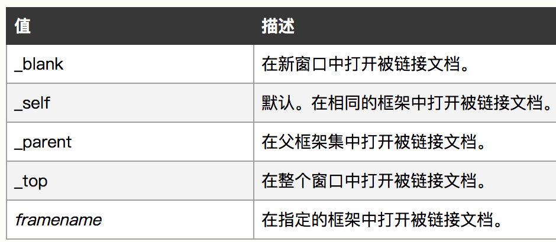

### HTML5新增标签

header nav section footer acticle aside hgroup figure audio video source canvas

### HTML5 新的input类型

email   url   number   range   Date pickers(date, month, week, time, datetime, datetime-local)   search   color

### WebSocket

WebSocket协议本质上是一个基于TCP的协议，在单个TCP连接上进行全双工通讯。

为了建立一个WebSocket连接，客户端浏览器首先要向服务器发起HTTP请求，这个请求和通常的HTTP请求不同，包含了一些附加头信息，其中附加头信息"Upgrade: WebSocket"表明这是一个申请协议升级的HTTP请求，服务器端解析这些附加的头信息然后产生应答信息返回给客户端，客户端和服务器段的WebSocket连接就建立起来了，双方就可以通过这个连接通道自由地传递信息，并且这个连接会持续存在直到客户端或者服务器端的某一方主动地关闭连接。

* WebSocket属性

只读属性readyState表示连接状态

0: 表示连接尚未建立。

1: 表示连接已建立，可以进行通信。

2: 表示连接正在进行关闭。

3: 表示连接已经关闭或者连接不能打开。

只读属性bufferedAmount已被send()放入正在队列中等待传输，但是还没有发出的UTF-8文本字节数。

````
function testWebSocket() {
    if ('WebSocket' in window) {
        //创建WebSocket对象
        var ws = new WebSocket(url, [protocol]);
        
        //连接建立时触发
        ws.open = function() {
            //使用连接发送数据
            ws.send();
        }

        //客户端接收服务端数据时触发
        ws.onmessage = function(evt) {
            console.log('接收的数据', evt.data);
        }

        //通信发生错误时触发
        ws.error = function() {
            //关闭连接
            ws.close();
        }

        //连接关闭时触发
        ws.close = function() {

        }
    } else {
        console.log('Brower cann't support WebSockt.');
    }
}
````

### a标签

* 目标target



### defer | async

script标签用于加载和执行脚本。

async和defer使script都不会阻塞DOM的渲染。

**defer**属性规定是否对脚本执行延迟，直到页面加载为止。

只有Internet Explorer支持defer属性。

**async**属性规定一旦脚本可用，则会异步执行。

async的执行，并不会按照script在页面中的顺序来执行，而是谁先加载完谁先执行。

### 浏览器内核

Trident(IE) Gecko(Firfox) Blink(Chrome) Webkit(Safari)

浏览器内核分为渲染引擎、JS引擎两部分

渲染引擎：DOM Tree -> CSS Tree -> Render Tree -> 布局(Layout) -> 绘制(Paint) -> 复合图层化

### 重绘和回流

*重绘*: 当页面中元素样式的改变并不影响它在文档流中的位置时(EX:color|visibility)，浏览器会将新样式赋予给元素并重新绘制它。

*回流*: 当Render Tree(DOM)中部分或全部元素的尺寸、结构或某些属性发生改变时，浏览器重新渲染部分或全部文档的过程。

回流要比重绘消耗性能开支更大。

回流必将引起重绘，重绘不一定引起回流。

