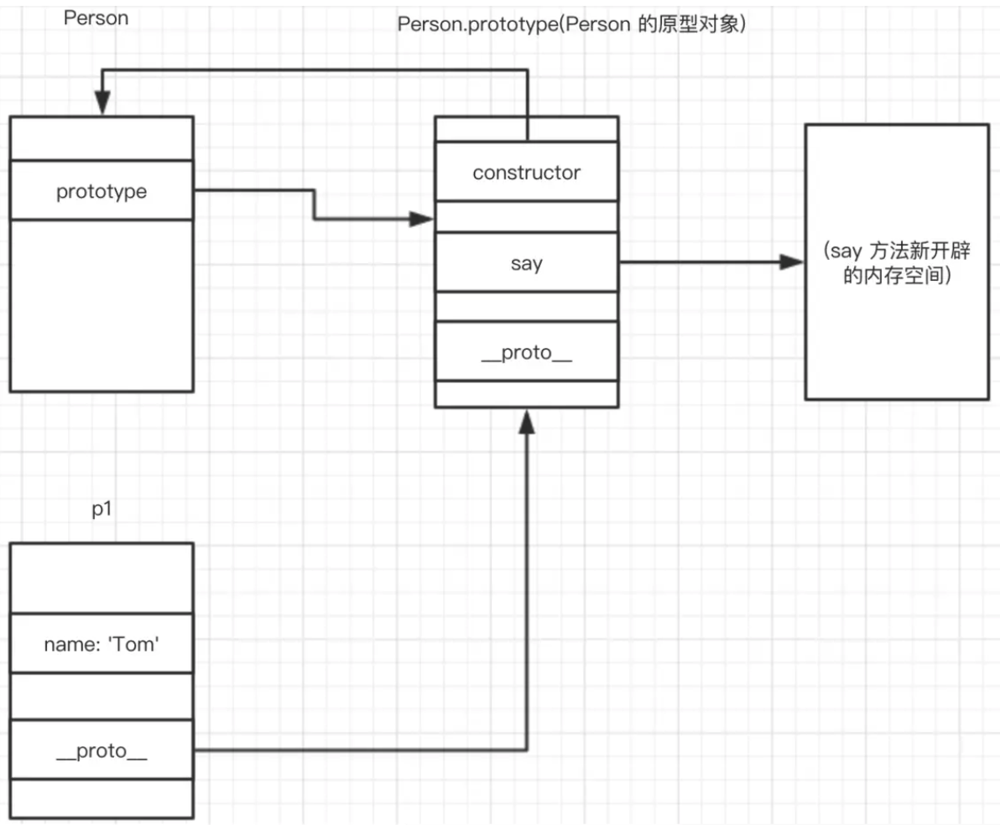

### this

**this是调用函数的那个对象**

* 当在函数调用的时候指向window

* 当方法调用的时候指向调用对象

* 当用apply和call上下文调用的时候指向传入的第一个参数

* 构造函数调用指向实例对象

### call、apply和bind

改变某个函数运行时的上下文(context)，即改变函数体内部this的指向。

第一个参数都是this要指向的对象，即指定的上下文；利用后续参数传参。

bind返回绑定函数，便于稍后调用；call、apply是立即调用。

call和apply作用完全一样，接受参数方式的方式不一样。

````
//this是指定的上下文，call把函数顺序传递进去，apply是把参数放在数组里进行传递。
func.call(this, arg1, arg2);
func.apply(this, [arg1, arg2]);
````

### 存储方式

cookie、sessionStorage、localStorage、indexedDB

**相同点**：都保存在浏览器端，同源

**不同点**：

* 传递方式不同

cookie会在浏览器和服务器间来回传递

sessionStorage和localStorage不会自动把数据发给服务器，仅在本地保存

* 存储数据大小不同

cookie数据大小不能超过4k

sessionStorage虽然也有存储大小的限制，但比cookie大得多，可以达到5M或更大

* 数据有效期不同

localStorage存储持久数据，浏览器关闭后数据不丢失除非主动删除数据

sessionStorage数据在当前浏览器窗口关闭后自动删除

cookie设置的cookie过期时间之前一直有效，即使窗口或浏览器关闭

* 作用域不同

#### Session和Cookie的区别

session是服务器端保存的一个数据结构，用来跟踪用户的状态，这个数据可以保存在集群、数据库和文件中。

Cookie是客户端保存用户信息的一种机制，用来记录用户的一些信息。

session的运行依赖于session ID, session ID是存在于Cookie中。

### 跨域

同源策略是浏览器的一个安全功能，不同源的客户端脚本在没有明确授权的情况下，不能读写对方资源。

若地址里面的协议、域名和端口号都相同则属于同源。

**跨域处理方式**：

* Ngnix反向代理

* Node.js中间件代理跨域

* 跨域资源共享CORS   Access-Control-Allow-Origin: *

* JSONP get

* domain.name 子域

### 声明提升(变量|函数)

````
function a(){}
var a;
console.log(typeof a); //function
````

````
console.log(a); //undefined
var a = 1;
var getNum = function() {
    a = 2;
}
function getNum() {
    a = 3;
}
console.log(a); //1
getNum();
console.log(a); //2
````

### 原型及原型链

* 构造函数

构造函数的执行过程

1. 当以new关键字调用时，会创建一个新的内存空间，标记为Animal的实例

2. 函数体内部的this指向该内存

3. 执行函数体内的代码：给this添加属性，即给实例添加属性

4. 默认返回this[新创建的内存空间]

* 原型对象

当一个函数创建好之后，都会有一个prototype属性，这个属性值是一个对象，我们把这个prototype属性所指向的内存空间称为这个函数的原型对象。

只要在这个原型对象上添加属性和方法，这些属性和方法都可以被改函数的实例所访问。

某个函数的原型对象会有一个constructor属性，这个属性指向该函数本身。

当某个函数当成构造函数来调用时，就会产生一个构造函数的实例。这个实例拥有一个__proto__属性，这个属性指向该实例的构造函数的原型对象。



* 原型

所有的引用类型(数组、对象、函数)，都具有对象特性，即可自由扩展属性(null除外)。

所有的引用类型(数组、对象、函数)，都有一个__proto__属性，属性值是一个普通的对象。

所有的函数，都有一个prototype属性，属性值是一个普通的对象。

所有的引用类型(数组、对象、函数)，__proto__属性值指向它的构造函数的prototype属性值。

* 原型链

链式结构

* 判断条件

object instanceof constructor运算符用来测试一个对象在其原型链是否存在一个构造函数。

object instanceof constructor判断的是constructor.prototype是否存在于object的原型链中。

prototypeObj.isPrototypeOf(object)方法用于测试一个对象是否存在于另一个对象的原型链上。

prototypeObj.isPrototypeOf(object)判断的是prototypeObj对象是否存在于object对象的原型链之中。

* 继承

ES5继承：子类先创建属于自己的this，然后再将父类的方法添加到this(也就是使用Parent.apply(this)的方式)或者this.__proto__(即Child.prototype=new Parent())

ES6继承：创建父类的实例对象this，然后再用子类的构造函数修改this

### 函数节流(throttle) | 函数去抖(debounce)

* 频繁执行DOM操作、资源加载等行为，导致UI停顿甚至浏览器崩溃

window对象的resize、scroll事件

拖拽时的mousemove事件

射击游戏中的mousedown、keydown事件

文字输入、自动完成的keyup事件

* debounce函数去抖

调用动作n毫秒后，才会执行该动作，若在这n毫秒内又调用此动作则将重新计算执行时间。

* throttle函数节流

预先设定一个执行周期，当调用动作的时刻大于等于执行周期则执行该动作，然后进入下一个新周期。

### 闭包

* 定义

闭包是指有权访问另一个函数作用域中的变量的函数。-《JavaScript高级程序设计》

从技术的角度讲，所有的JavaScript函数都是闭包；它们都是对象，它们都关联到作用域链。-《JavaScript权威指南》

当函数可以记住并访问所在的词法作用域时，就产生了闭包，即使函数是在当前词法作用域之外执行。-《你不知道的JavaScript》

* 作用

读取函数内部的变量

让这些变量始终在内存中

* Code Example

````
var scope = "global scope";
function checkScope() {
    var scope = "local scope";
    function f() { return scope; }
    return f();
}
checkScope();//local scope

var scope = "global scope";
function checkScope() {
    var scope = "local scope";
    function f() { return scope; }
    return f;
}
checkScope()();//local scope
````

### 物理分辨率 逻辑分辨率

物理分辨率是硬件所支持的，逻辑分辨率是软件可以达到的，互转的话乘以像素倍率。

### 从服务器主动推送data到客户端的方式

html5 websoket | WebSocket通过Flash | XHR长时间连接 | XHR Multipart Streaming | 不可见的iframe

### SVG和Canvas的区别

* SVG

不依赖分辨率

支持事件绑定

大型渲染区域的程序(例如百度地图)

不能用来实现网页游戏

* Canvas

依赖分辨率

不支持事件绑定

最合适网页游戏

### JavaScript异步编程

回调函数   事件监听   发布/订阅   Promise对象

* Promise

````
const sleep = (time) => new Promise((resolve, reject) => setTimeout(resolve, time));
(async function(){
    for (var i = 0; i < 5; i++) {
        await sleep(1000);
        console.log(i);
    }
})();
````

* Generator

````
function* sayHelloWorld() {
    yield 'Hello';
    yield 'World';
    return 'End';
}
````

* Async

````
function timeout(ms) {
    return new Promise((resolve) => {
        setTimeout(resolve, ms);
    });
}

async function asyncPrint(value, ms) {
    await timeout(ms);
    console.log(value);
}

asyncPrint('Hello World!', 50);
````

### Ajax

* readystate

0: (未初始化)未调用open方法

1: (载入)已调用send方法，正在发送请求

2: (载入完成)send完成

3: (解析)正在解析响应内容

4: (完成)响应内容解析完成

### 图片处理

* 图片预加载

**原理**

通过CSS或者JavaScript，先请求图片到本地，再利用浏览器的缓存机制，当要使用图片时(图片路径一致)，浏览器直接从本地缓存获取到图片，加快图片的加载速度。

* 图片懒加载

