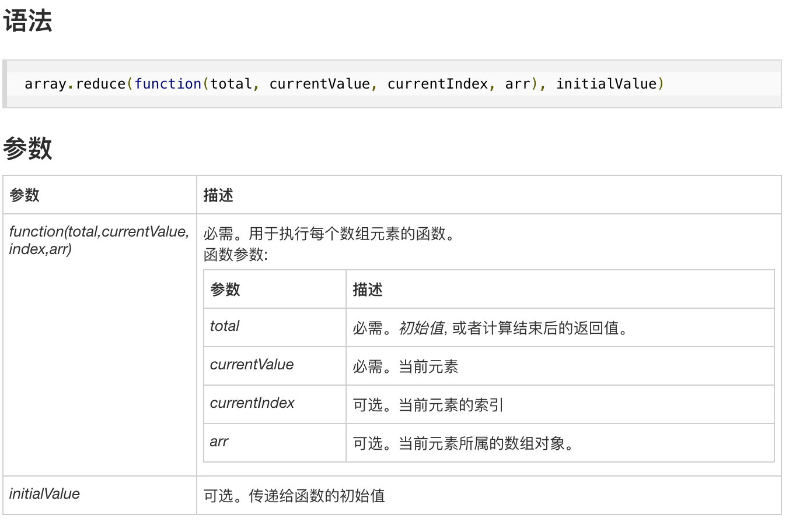

### 数组的方法

#### ECMAScript3

##### join()

作用: 可以把一个数组的所有元素都转换成字符串，然后再把它们连接起来。

参数: 分隔符；无参数，默认,分隔

是否修改原始值: 否

返回值: 字符串

````
var beforeArr = [1, 2, 3],
    returnStr = beforeArr.join();
console.log(beforeArr); //[1, 2, 3]
console.log(returnStr); //1,2,3
````

##### reverse()

作用: 颠倒数组元素的顺序并返回颠倒后的数组。

参数: 无参数

是否修改原始值: 是 

返回值: 颠倒后的数组

````
var beforeArr = [1, 2, 3],
    afterArr = beforeArr.reverse();
console.log(beforeArr); //[3, 2, 1]
console.log(afterArr); //[3, 2, 1]
````

##### sort()

* 作用: 在原数组上对数组元素进行排序，返回排序后的数组。

* 参数: 比较函数

如果比较函数第一个参数应该位于第二个参数之前，那么比较函数将返回一个小于0的数。如果比较函数第一个参数应该位于第二个参数之后，那么比较函数就会返回一个大于0的数。如果两个参数相等，那么比较函数将返回0。

* 是否修改原始值: 是

* 返回值: 排序后的数组

````
var beforeArr = ['Abc', 'abc', 111, '1bc'];
console.log(beforeArr.sort()); //[111, "1bc", "Abc", "abc"]
console.log(beforeArr); //[111, "1bc", "Abc", "abc"]
````

##### concat()

作用: 创建并返回一个数组

参数: 需要添加的元素，如果有些参数是数组，那么它将被展开

注意: concat()并不能递归展开一个元素为数组的数组

是否修改原始值: 否

返回值: 合并的数组

````
var arr = [1, 2],
    addEl1 = ['b', 'c'],
    addEl2 = [3, [4, 5]],
    addEl3 = 'd';
console.log(arr.concat(addEl1, addEl2, addEl3)); //[1, 2, "b", "c", 3, [4, 5], "d"]
console.log(arr); //[1, 2]
````

##### slice()

作用: 返回数组的一个片段和子数组

参数: 片段的开始和结束位置

是否修改原始值: 否

返回值: 第一个参数指定的位置和所有到不含第二个参数指定的位置之间的所有数组元素。

````
var arr = [1, 2, 3, 4, 5];
console.log(arr.slice(0, 3)); //[1, 2, 3]
console.log(arr.slice(2)); //[3, 4, 5]
console.log(arr.slice(-3, -2)); //[3]
console.log(arr); //[1, 2, 3, 4, 5]
````

##### splice()

作用: 插入或删除数组元素的通用方法

参数

    第一个参数: 要插入或删除的元素在数组中的位置
    第二个参数: 要从数组删除的元素个数，被省略则将删除从开始元素到数组结尾处的所有元素
    后续参数: 从第一个参数指定的位置处开始插入的元素

是否修改原始值: 是

返回值: 删除的元素数组

````
var arr = [1, 2, 3, 4, 5];
console.log(arr.splice(1, 2, 'a')); //[2, 3]
console.log(arr); //[1, "a", 4, 5]
````

##### push pop

* push

作用: 在数组的尾部添加一个或多个元素

参数: 需要添加的元素

是否修改原始值: 是

返回值: 数组新的长度

````
var arr = [1, 2, 3, 4, 5];
console.log(arr.push(6)); //6
console.log(arr); //[1, 2, 3, 4, 5, 6]
````

* pop

作用: 删除数组的最后一个元素

参数: 无

是否修改原始值: 是

返回值: 删除的最后一个元素

````
var arr = [1, 2, 3, 4, 5];
console.log(arr.pop());
console.log(arr);
````

##### unshift shift

* unshift

作用: 在数组的头部添加一个或多个元素

参数: 需要添加的元素

是否修改原始值: 是

返回值: 数组新的长度

````
var arr = [1, 2, 3, 4, 5];
console.log(arr.unshift(0)); //6
console.log(arr); //[0, 1, 2, 3, 4, 5]
````

* shift

作用: 在数组的头部删除第一个元素并将其返回

参数: 无

是否修改原始值: 是

返回值: 删除的第一个元素

````
var arr = [1, 2, 3, 4, 5];
console.log(arr.shift()); //1
console.log(arr); //[2, 3, 4, 5]
````

#### ECMAScript5

##### forEach

作用: 遍历

参数: 传递的函数(数组元素 元素的索引 数组本身)

返回值: undefined

````
var arr = [1, 2, 3, 4, 5],
    res = arr.forEach(function(item, index, self){
        self[index] = item + 1;
    });
console.log(res, arr); //undefined [2, 3, 4, 5, 6]
````

##### map

````
var arr = [1, 2, 3, 4, 5],
    res = arr.map(function(item, index, self){
        return item + 1;
    });
console.log(res, data); //[2, 3, 4, 5, 6] [1, 2, 3, 4, 5]
````

##### filter

````
var arr = [1, 2, 3, 4, 5],
    res = arr.filter(function(item, index, self){
        return item % 2 === 0;
    });
console.log(arr, res); //[1, 2, 3, 4, 5] [2, 4]
````

##### every some

* every

作用: 当且仅当针对数组中的所有元素调用判定函数都返回true，它才返回true。

````
var arr = [1, 2, 3, 4, 5],
    res = arr.every(function(item, index, self){
        return item < 6;
    });
````

* some

作用: 当数组中至少有一个元素调用判定函数返回true，它就返回true，并且当且仅当数值中的所有元素调用判定元素都返回false，它才会返回false。

````
var arr = [1, 2, 3, 4, 5],
    res = arr.some(function(item, index, self){
        return item > 6;
    });
console.log(arr, res); //[1, 2, 3, 4, 5] false
````

##### reduce reduceRight

作用: reduce和reduceRight方法使用指定的函数将数组元素进行组合，生成单个值。

参数



````
var arr = [1, 2, 3, 4, 5],
    res = arr.reduce(function(result, currentValue, currentIndex, arr){
        result[currentIndex] = currentValue;
        return result;
    }, {});
console.log(arr, res); //[1, 2, 3, 4, 5] {0: 1, 1: 2, 2: 3, 3: 4, 4: 5}
````

##### indexOf lastIndexOf

````
var arr = [1, 2, 3, 4, 5];
console.log(arr.indexOf(2), arr.lastIndexOf(2)); //1 1
````

### 字符串

* slice、substring和substr的区别

````
var str = 'Hello World!'
/*
slice
    两个参数：起始位置和结束位置（不包括结束位置）
    当接收的参数是负数时，slice会将字符串的长度和对应的负数相加，结果作为参数
*/
console.log(str.slice(4, 7));//o W

/*
substring
    两个参数：起始位置和结束位置（不包括结束位置）
    substring是以两个参数中较小一个作为起始位置，较大的参数作为结束位置substring将负参数转换为0
*/
console.log(str.substring(7, -6));//Hello W

/*
substr
    两个参数：起始位置和所要返回的字符串长度
    将负的第一个参数加上字符串的长度，第二个参数转换为0
*/
console.log(str.substr(-6, 7));//World!
````

### 判断是否为数组

````
function isArray(unknown){
    return Object.prototype.toString.call(unknown) === '[object Array]';
}

function isArrayByType(unknown){
    return typeof unknown;
}

//用instanceof和constructor判断的变量，必须在当前页面声明
function isArrayByInstance(unknown){
    return unknown instanceof Array;
}

function isArrayByConstructor(unknown){
    return unknown.constructor === Array;
    //return unknown.__proto__.constructor === Array;
}
````

### 数组去重

参考链接：https://www.jb51.net/article/118657.htm

* 方法1 ES6的set

````
function distinct(arr) {
    if (Array.isArray(arr)) {
        return Array.from(new Set(arr));
        //return [...new Set(arr)];
    }
}
````

* 方法2 利用对象的属性不能相同的特点进行去重

````
function distinct(arr) {
    var i, len = arr.length, obj = {}, res = [];

    if (Object.prototype.toString.call(arr) === '[object Array]') {
        for (i = 0; i < len; i++) {
            if (!obj[arr[i]]) {
                obj[arr[i]] = 1;
                res.push(arr[i]);
            }
        }
    }

    return res;
}
````

* 方法3 indexOf

* 方法4 排序去重

* 方法5

双层循环，外层循环元素，内层循环比较值：值相同就删去这个值

注意点：删除元素之后，需要将数组的长度也减1

* 方法6

双层循环，外层循环元素，内层循环比较值：如果有相同的值则跳过，不相同则放入数组

### 平铺数组

* 方法1

````
function flattenDeep(arr){
    return arr.join(',').split(',');
}
````

* 方法2 递归

````
const deepFlatten = arr => [].concat(...arr.map(v => (Array.isArray(v) ? deepFlatten(v) : v)));
````


