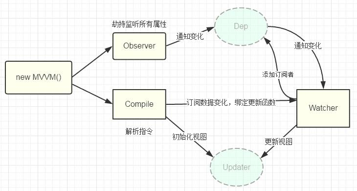

### apply、call的实现

参考链接：https://github.com/mqyqingfeng/Blog/issues/11

* call的实现

````
Function.prototype.myCall = function(context) {
    //考虑绑定对象为null的情况
    var context = Object(context) || window;

    //将函数设置为对象的属性
    context.fn = this;

    //参数
    var args = [];
    for(var i = 1, len = arguments.length; i < len; i++){
        args.push('arguments[' + i + ']');
    }
    console.log(args);

    //执行该函数
    var result = eval('context.fn(' + args + ')');

    //删除该函数
    delete context.fn;
    return result;
}
    
var testObj = {
    value: 1
};
function testFunc(name, age){
    console.log(name);
    console.log(age);
    console.log(this.value);
}
testFunc.myCall(testObj, 'yxq', 18);
````

* apply的实现

````
Function.prototype.myApply = function(context, arr){
    //考虑绑定对象为null的情况
    var context = Object(context) || window;

    //将函数设置为对象的属性
    context.fn = this;

    //参数
    var result,
        args = [];
    //执行该函数
    if (arr) {
        for (var i = 0, len = arr.length; i < len; i++) {
            args.push('arr[' + i + ']');
        }
        result = eval('context.fn(' + args + ')');
    } else {
        result = context.fn();
    }

    //删除该函数
    delete context.fn;
    return result;
}
````

### 文件下载

参考网站：StackOverFlow

````
function downloadExcel(xhRequest, header, fileName){
    var xhr = new XMLHttpRequest();
    xhr.open(xhRequest.type, xhRequest.url);
    xhr.setRequestHeader('token', header.token);
    xhr.responseType = 'blob';

    xhr.onload = function(){
        if (xhr.status === 200) {
            var ele = document.createElement('a');
            document.body.appendChild(ele);
            ele.style.cssText = 'display:none';
            var blob = new Blob([this.response], {type: 'application/vnd.ms-excel'});
            
            if(navigator.appVersion.toString().indexOf('.net') > 0) {
                window.navigator.msSaveBlob(blob, fileName);
            } else {
                var windowUrl = window.URL || window.webkitURL || {},
                url = windowUrl.createObjectURL(blob);
                ele.href = url;
                ele.download = fileName;ele.click();
                setTimeout(function(){
                    document.body.removeChild(ele);
                    windowUrl.revokeObjectURL(url);
                }, 0);
            }
        } else {
            console.log(xhr.status);
        }
    }
}
````

### 事件

参考书籍：JavaScript高级程序设计(第3版)

事件流存在三个阶段：事件捕获阶段、处于目标阶段、事件冒泡阶段

````
var EventUtil = {
    addHandler: function(element, type, handler) {
        if (element.addEventListener) {
            element.addEventListener(type, handler, false);
        } else if (element.attachEvent) {
            element.attachEvent('on' + type, handler);
        } else {
            element['on' + type] = handler;
        }
    },
    removeHandler: function(element, type, handler) {
        if (element.removeEventListener) {
            element.removeEventListener(type, handler, false);
        } else if (element.detachEvent) {
            element.detachEvent('on' + type, handler);
        } else {
            element['on' + type] = null;
        }
    },
    getEvent: function(event) {
        return event || window.event;
    },
    //返回事件的目标
    getTarget: function(event) {
        return event.target || event.srcElement;
    },
    //阻止默认事件
    preventDefault: function(event) {
        if (event.preventDefault) {
            event.preventDefault();
        } else {
            event.returnValue = false;
        }
    },
    //阻止事件冒泡
    stopPropagation: function(event) {
        if (event.stopPropagation) {
            event.stopPropagation();
        } else {
            event.cancelBubble = true;
        }
    }
};
````

### 实现模块化

* 方法1

````
var calculator = (function() {
    var desc = 'Hello ';

    function sayHello(name) {
        console.log(desc + name);
    }

    return {
        sayHello: sayHello
    }
})();
calculator.sayHello('YXQ');
````

* 方法2

````
(function(calculator) {
    var desc = 'Hello ';

    calculator.sayHello = function(name) {
        console.log(desc + name);
    }

    window.calculator = calculator;
})(window.calculator || {});
calculator.sayHello('YXQ');
````

### Vue双向绑定原理

* 方法1

通过Object对象的defineProperty属性，重写data的set和get函数来实现

````
<div id="app">
    <input type="text" id="txt"/>
    <p id="show-txt"></p>
</div>
````
````
var obj = {};
Object.defineProperty(obj, 'txt', {
    get: function() {
        return obj;
    },
    set: function(newValue) {
        document.getElementById('txt').value = newValue;
        document.getElementById('show-txt').innerHTML = newValue;
    }
});
document.addEventListener('keyup', function(e){
    obj.txt = e.target.value;
});
````

* 方法2

参考链接：https://juejin.im/post/5acc17cb51882555745a03f8



````
<div id="app">
    <form>
        <input type="text" v-model="count"/>
        <button type="button" v-click="add">添加</button>
    </form>
    <p v-bind="count"></p>
</div>

<script>
function myVue(options) {
    this._init(options);
}

myVue.prototype._init = function(options) {
    this.$options = options;
    this.$el = document.querySelector(options.el);
    this.$data = options.data;
    this.$methods = options.methods;

    this._binding = {};
    this.obverse(this.$data);
    this._compile(this.$el);
}

myVue.prototype._obverse = function(obj) {
    var _this = this;
    Object.keys(obj).forEach(function(key){
        if (obj.hasOwnProperty(key)) {
            _this._binding[key] = {
                _directives: []
            };
            var value = obj[key];
            if (typeof value === 'object') {
                _this._observe(value);
            }
            var binding = _this._binding[key];
            Object.defineProperty(_this.$data, key, {
                enumerable: true,
                configurable: true,
                get: function() {
                    console.log(`${key}获取${value}`);
                    return value;
                },
                set: function(newVal) {
                    console.log(`${key}更新${newVal}`);
                    if (value !== newVal) {
                        value = newVal;
                        binding._directives.forEach(function(item){
                            item.update();
                        });
                    }
                }
            });
        }
    });
}

myVue.prototype._compile = function(root) {
    var _this = this,
        nodes = root.children;
    for (var i = 0; i < nodes.length; i++) {
        var node = nodes[i];
        if (node.children.length) {
            this._compile(node);
        }

        if (node.hasAttribute('v-click')) {
            node.onclick = (function(){
                var attrVal = nodes[i].getAttribute('v-click');
                return _this.$methods[attrVal].bind(_this.$data);
            })();
        }

        if (node.hasAttribute('v-model') && (node.tagName == 'INPUT' || node.tagName == 'TEXTAREA')) {
            node.addEventListner('input', (function(key) {
                var attrVal = node.getAttribute('v-model');
                _this._binding[attrVal]._directives.push(new Watcher('input', node, _this, attrVal, 'value'));

                return function() {
                    _this.$data[attrVal] = nodes[key].value;
                }
            })(i));
        }

        if (node.hasAttribute('v-bind')) {
            var attrVal = node.getAttribute('v-bind');
            _this._binding[attrVal]._directives.push(new Watcher('text', node, _this, attrVal, 'innerHTML'));
        }
    }
}

function Watcher(name, el, vm, exp, attr) {
    this.name = name;
    this.el = el;
    this.vm = vm;
    this.exp =exp;
    this.attr = attr;

    this.update();
}

Watcher.prototype.update = function () {
    this.el[this.attr] = this.vm.$data[this.exp];
}

window.onload = function() {
    var app = new myVue({
        el: '#app',
        data: {
            count: 0
        },
        methods: {
            add: function() {
                this.count ++;
            }
        }
    });
}
</script>
````


