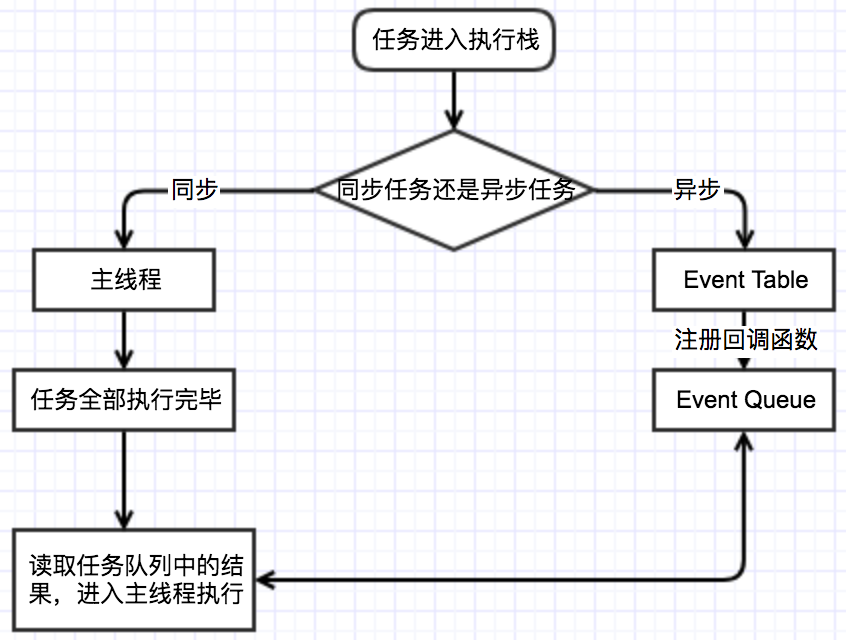
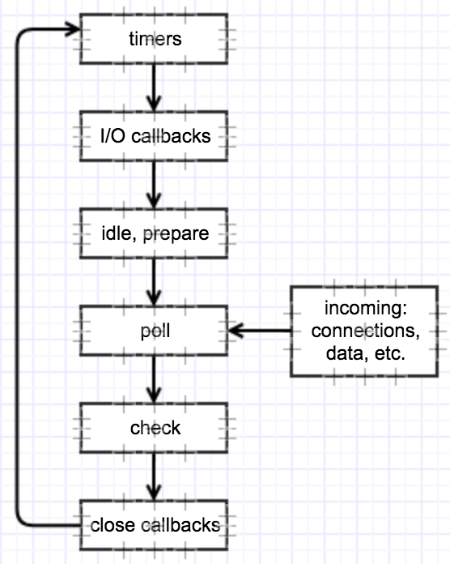

### Node多进程

Node.js提供了cluster模块和child_process模块创建子进程，从而提高CPU的利用率。

### 事件循环(Event Loop)

#### 浏览器端

执行栈 事件队列(Task Queue)

不同的任务源会被分配到不同的Task队列中，任务可以分为微任务(microtask)|jobs和宏任务(macrotask)|task

微任务: process.nextTick promise Object.observe MutaionObsever

宏任务: setTimeout setInterval setImmediate I/O  UI Rendering

当前的执行栈执行完毕时会立刻先处理所有微任务队列中的事件，
然后再去宏任务队列中取出一个事件，同一个事件循环中，
微任务永远在宏任务之前执行。

同步和异步任务分别进入不同的执行"场所"，同步的进入主进程，异步的进入Event Table并注册函数。

当指定的事情完成时，Event Table会将这个函数移入Event Queue。

主线程内的任务执行完毕为空，会去Event Queue读取对应的函数，进入主进程执行。

上述过程会不断重复，也就是常说的Event Loop(事件循环)。

--------------------

JS引擎存在monitoring process进程，会持续不断地检查主进程执行栈是否为空，一旦为空，就会去Event Queue那里检查是否有等待被调用的函数。

--------------------

setTimeout这个函数是经过指定时间后，把要执行的任务加入到Event Queue中

setTimeout(fn, 0)的含义是指定某个任务在主线程最早可得的空闲时间执行。

#### Node

* timer

timer阶段会执行setTimeout和setInterval

一个timer指定的时间并不是准确时间，而是在达到这个时间后尽快回调，可能会因为系统正在执行别的事务而延迟。

下限的时间范围: [1, 2147483647]，如果设定的时间不在这个范围，将被设置为1。

* I/O

I/O阶段会执行除了close事件、定时器和setImmediate的回调

* idle, prepare

* poll

poll阶段做的事情：执行到点的定时器；执行poll队列中的事件。

并且当poll中没有定时器时，会发现以下两件事情

    如果poll队列不为空，会遍历回调会同步执行，知道队列为空或者系统限制

    如果poll队列为空，会有两件事发生：如果有setImmediate需要执行，poll阶段会停止并且进入到check阶段会执行setImmediate。如果没有setImmediate需要执行，会等待被加入队列中并立即执行回调。

如果有别的定时器需要被执行，会回到timer阶段执行回调。

* check

check阶段执行setImmediate

* close callbacks

close callbacks阶段执行close事件