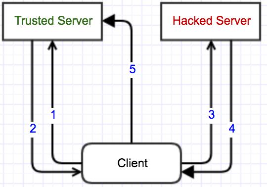

### XSS(跨站脚本攻击, Cross Site Scripting)

* DOM XSS

基于文档对象模型Document Object Model, DOM的一种漏洞。

解决方案：尽量不写eval、innerHTML、document.write语句

* 反射型XSS

发请求时，XSS代码出现在URL中，提交给服务器端。服务器端返回的内容，也带上了这段XSS代码，最后浏览器执行XSS代码。

* 存储型XSS(最持久,最隐藏)

提交的XSS代码会存储在服务器端。

#### 解决方案

* 校验

输入校验，输出转译(ESAPI)

* Cookie的处理

HttpOnly: JS脚本将无法读取到Cookie信息

* 浏览器XSS防御

X-XSS-Protection: 对反射型XSS进行一些防御，当检测到跨站脚本攻击(XSS)时，浏览器将停止加载页面。

### CSRF(跨站请求伪造，Cross-site request forgery)

#### CSRF

1: 浏览并登陆信任网站

2: 验证通过，在Client产生信任网站的Cookie

3: 用户在没有登出信任网站的情况下，访问危险网站

4: 危险网站要求访问信任网站，发出一个请求

5: 根据信任网站在4的请求，浏览器带着2产生的Cookie访问

6: 信任网站不知道5中的请求是Client发出的还是危险网站发出的，由于浏览器会自动发出Client的Cookie，所以信任网站会根据用户的权限处理5的请求，这样危险网站就达到了模拟用户操作的目的。

#### 解决方案

* 检查http refer是否是同域名

* 避免登录的session长时间存储在客户端

* 关键请求使用验证码或者token机制

* 自定义header

### HTTP劫持

Secure: 只有在HTTPS连接中被浏览器传递到服务器端进行会话验证，如果是HTTP连接就不会传递该信息。

Strict-Transport-Security: HTTP Strict Transport Security(通常简称HSTS)告诉浏览器只能通过HTTPS访问当前资源，静止HTTP方式。

### 点击劫持

X-Frame-Options禁止防止网页被框架盗链或者点击劫持。

DENY: 表示该页面不允许在frame中展示，即便是在相同域名的页面中嵌套也不允许。

SAMEORIGIN: 表示该页面可以在相同域名页面的frame中展示。

ALLOW-FROM uri: 表示该页面可以在指定来源的frame中展示。

### 其他

* iframe sandbox安全属性

* 错误内容推断

X-Content-Type-Options: 明确禁止浏览器去推断响应类型(nosniff)，防止浏览器进行错误内容的推断。

* 防火防盗防猪队友：不安全的第三方依赖包

* 本地存储数据泄露

* 没有用的文件，请愉快地delete

### Content-Security-Policy(CSP): 网络安全政策[白名单制度]

用来设置允许的资源来源以及对脚本执行环境的控制等。

* 参考链接

http://www.ruanyifeng.com/blog/2016/09/csp.html

https://developer.mozilla.org/zh-CN/docs/Web/Security/CSP
